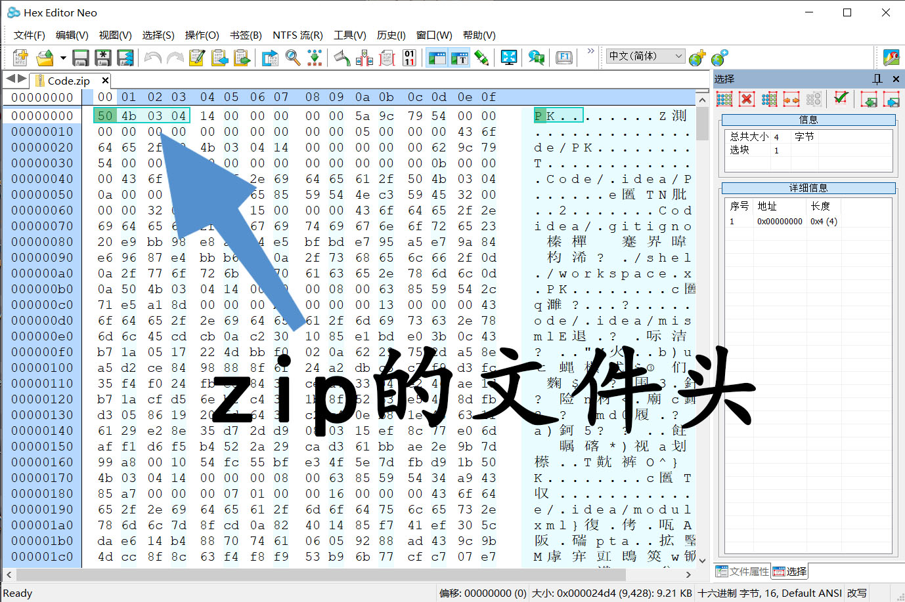
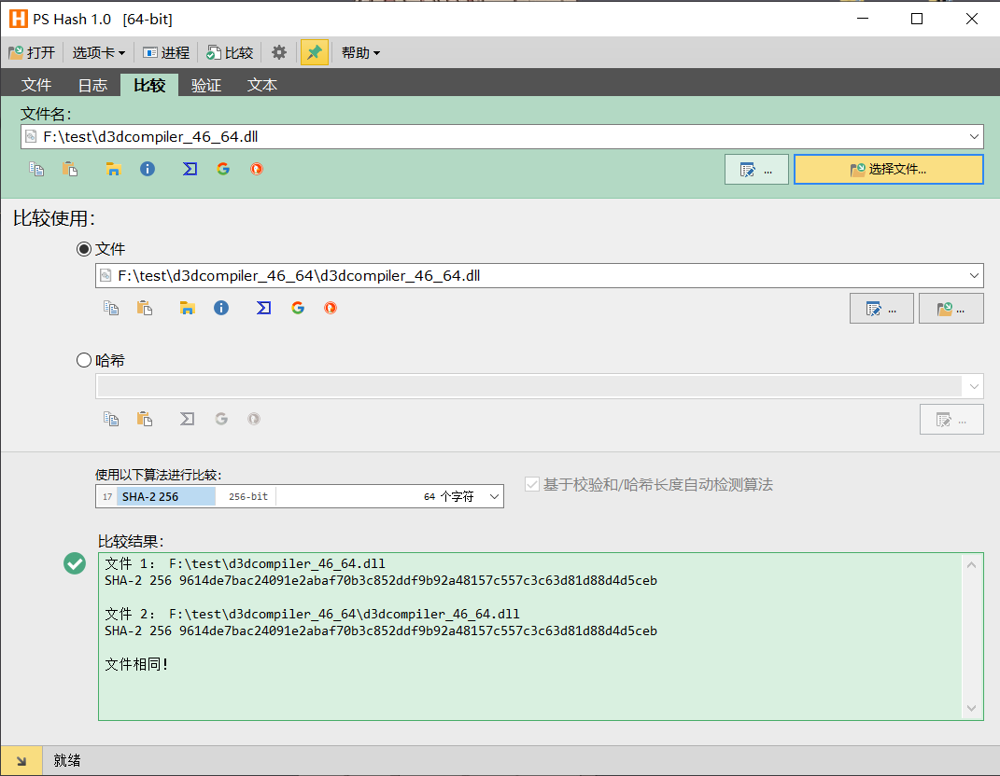

# File-Header-Forger
绕过部分云盘的文件分享限制
## 用途
此工具针对使用部分云盘时,受到文件分享类型限制进行伪造
## 原理
- aliyundrive在分享文件时,会查看文件头(即文件类型),假如检测到压缩文件等受到限制的文件时会无法分享,在对受限制的文件进行伪造文件头后,即可突破限制,正常分享
- 如zip的文件头为504b0304,将其改为aliyundrive支持的格式即可

- 经过多次测试,经伪造后再还原的文件与原文件对比,hash值始终相同,可放心使用(毕竟只是改了文件的前几个字节)

- 目前(2022/5/2)经过多次测试,aliyundrive只对文件头进行了限制,没对扩展名做限制
## 缺点
使用麻烦,配置麻烦,会随之后的更新逐步完善操作体验
## 参考内容:
- https://blog.csdn.net/qq_40657585/article/details/83097386
- https://blog.csdn.net/qq_36171645/article/details/88966127
- https://qa.1r1g.com/sf/ask/3714342551/?lastactivity
- https://www.cnblogs.com/schut/p/8410961.html
- https://blog.51cto.com/u_15052689/2562469
- https://blog.csdn.net/beijingyk/article/details/108581150
- https://bluebird.blog.csdn.net/article/details/51122027
- https://blog.csdn.net/qq_35441988/article/details/84994453
- https://blog.csdn.net/weixin_40895135/article/details/121033002
- https://www.jb51.net/article/143446.htm
---
##### 2022/5/2 21:10 Edited by cyh128

