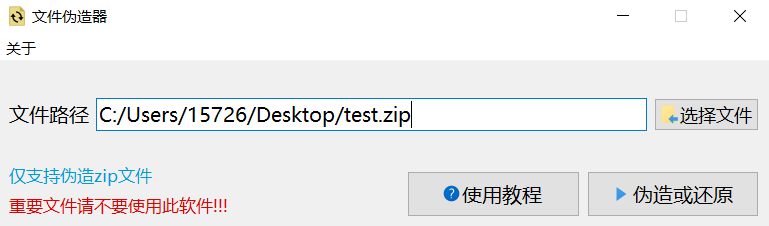

# 已停止更新
<p align="center">
  <a>
    
  </a>

  <h2 align="center">File Header Forger</h2>
  <p align="center">
    一个 <b>伪造文件文件头</b> 的软件
  </p>

</p>

- 使用Python编写的程序,GUI使用PyQt5
- 该程序可用于绕过部分网盘的分享限制（如阿里云盘）

## 环境要求
- windows用户可以直接使用`releases`内已打包好的文件
- macos和linux用户需自行安装环境`Python3`和`PyQt5`或根据`V1.0`版本(无GUI)的文件自行修改
  - `git clone https://github.com/15dd/File-Header-Forger.git`或`直接网页内下载源代码`
  - 运行`main.py`

## 原理
经本人测试（2023.1)，阿里云盘对文件不光有后缀识别还有文件头识别（不确定，但修改它有效），所以光修改后缀没用。什么是文件头可以自行搜索。如下图，这是一张zip格式的文件的十六进制数据的图片，选中的`504B0304`是zip格式的文件头，它可以说明这是一个zip格式的文件，所以我们想绕过检测的话，也要把它改了。

我的做法是将首尾的4个字节对调，实现修改
```python
with open(filePath,"rb+") as rawFile:
    rawFile.seek(0,0)   #移动到文件的0(头)处偏移为0的位置
    BOC = rawFile.read(4) #读取节                
    rawFile.seek(-4,2) #移动到文件的2(尾)处偏移为-4(向前4个字节)的位置
    EOC = rawFile.read(4)
    rawFile.seek(-4,2) 
    rawFile.write(BOC) #向文件末尾的4个写成文件开头的4个字节
    rawFile.seek(0,0)
    rawFile.write(EOC) #向文件开头的4个写成文件末尾的4个
    rawFile.close() #关闭文件
```
## 使用教程
视频教程：bilibili.com/video/BV1A24y1B7Xu

1. 将需要伪造的文件的路径填入框内（不要加双引号），支持选择文件或拖入文件 <br>
仅支持伪造zip文件，如果你想伪造的文件不是zip格式，用压缩软件（如winrar）压缩成zip格式即可 


2. 点击伪造或还原按钮，提示伪造成功，文件后缀自动改成.pdf，这时你的文件就可以骗过一些程序的文件类型识别
3. 如需还原文件（即解压文件），将伪造的文件（pdf格式）拖入程序，点击伪造或还原按钮，提示还原成功
   
